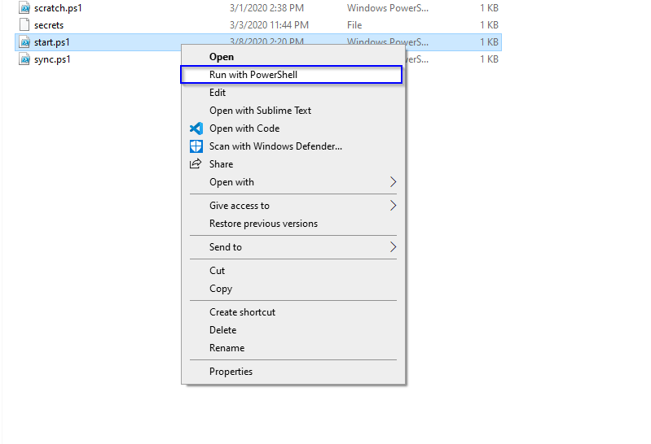

# Lokaal aan de praat krijgen

- Open de verschillende scriptjes met PowerShell via Windows verkenner:

## De Gatsby server starten

Open `start.ps1`, indien je een nieuwe pagina maakt in Umbraco moet je wel sluiten en herstarten.
Wanneer het script zegt dat Gatsby zover is, dan kan je de site openen op [http://localhost:8000](http://localhost:8000).

## De laatste code binnen trekken

Open `sync.ps1` om de laatstse wijzigingen binnen te halen.

## De site publisheren op live te zetten

Open `publish.ps1` om alles te genereren.
Na afloop zou alles in `src/client/public` te vinden moeten zijn.
Deze files kan je dan via FTP op de website zetten.
